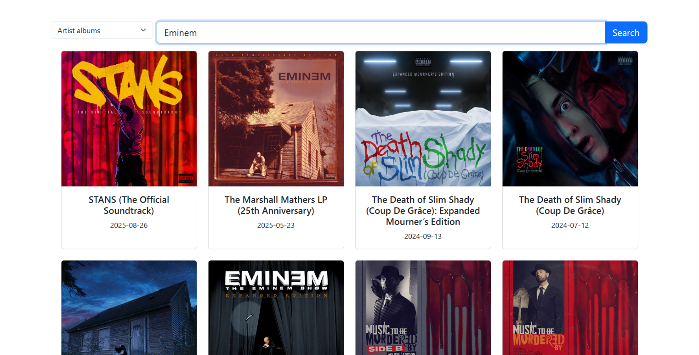
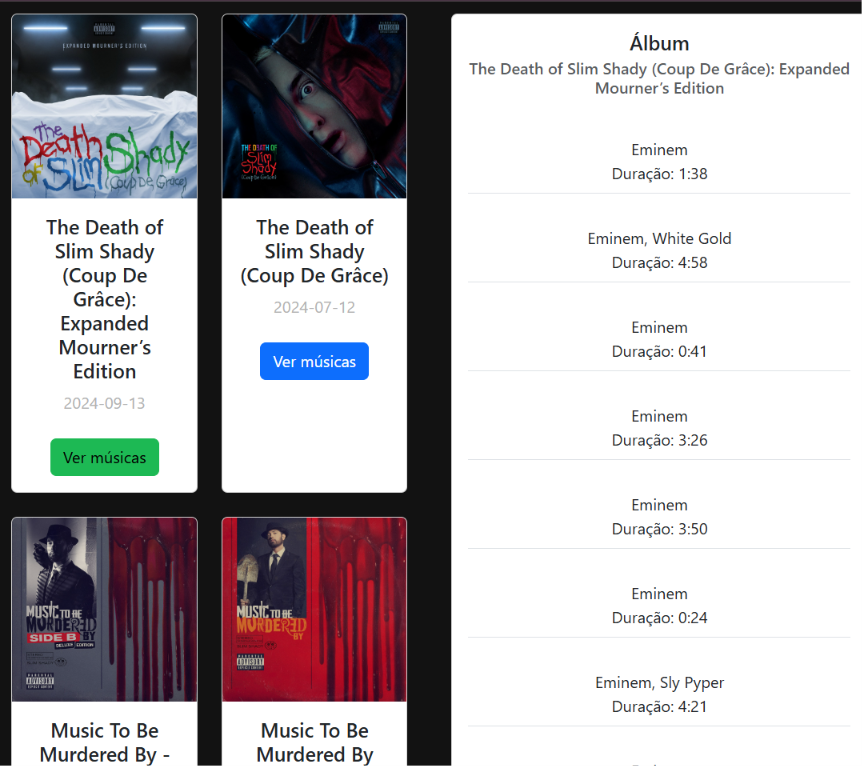
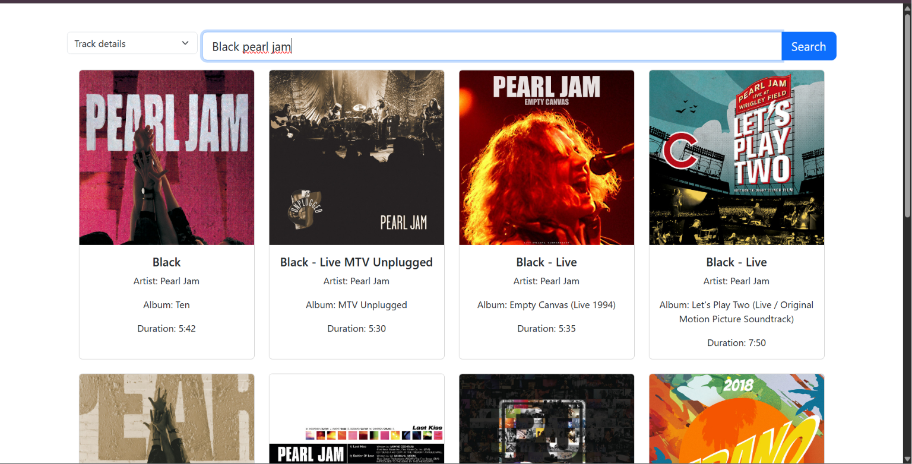
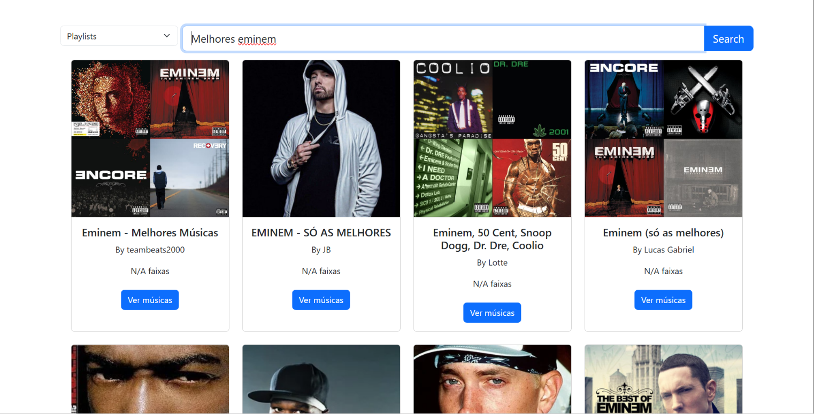
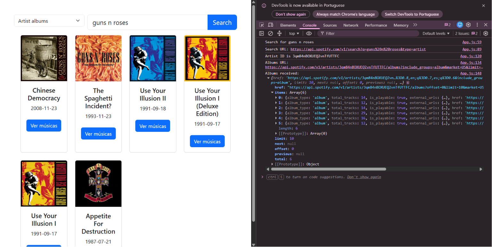

# Spotify API com React 🎧


Este projeto foi desenvolvido como parte do meu processo de **aprendizado com o React**. A aplicação se conecta à API oficial do Spotify para buscar artistas e listar seus álbuns em uma interface responsiva, moderna e organizada com o Bootstrap.

Para a construção desta aplicação, utilizei como base informações de tutoriais em vídeo e, principalmente, a **documentação oficial para desenvolvedores do Spotify (https://developer.spotify.com/)**, o que me permitiu entender melhor como integrar APIs externas em projetos React, com algumas modificações e limitações que o spotify permite, de visibilidade limitando para 10 apenas a visualização do conteudo pesquisavel.

---

## 📸 Demonstração do Projeto

> **Nota:** Abaixo estão as demonstrações visuais das principais funcionalidades implementadas e planejadas para a plataforma de exibição de músicas.

### 🔍 Busca e Exibição de Álbuns de Artistas
Ao digitar o nome de um artista (como *Eminem*), o sistema identifica seu ID único e renderiza um grid com as capas e títulos oficiais de até 50 álbuns.



Ao clicar no botão ver músicas(album ou playlists) ele abrira uma listagem com todas as musicas incluidas.



*Descrição:* Tela principal consumindo o endpoint de busca (`/search`) e o de álbuns (`/artists/{id}/albums`), estilizada com cartões responsivos do React Bootstrap.

### 🎵 Músicas e Faixas (Tracks)
Visualização detalhada das músicas que compõem cada álbum listado.



*Descrição:* Interface planejada para exibir os nomes das faixas, duração e número de reprodução de acordo com os dados obtidos da API.

### 📋 Playlists Buscaveis
Seção voltada para a curadoria de playlists baseadas nos resultados obtidos.



*Descrição:* Organização de listas de reprodução dinâmicas geradas a partir da integração com os dados do perfil do usuário na API do Spotify.

### 🛠️ Console do navegador
Demosntrando a parte do backend funcionando no navegador pelo console, após a pesquisa via API.



*Descrição:* Funcionalidades da API em funcionamento após digitar alguma pesquisa, mostrando os resultados e informações complementares como capa, nome, artista e outros dados.

---

## 🧠 Aprendizados e Desafios Superados

Desenvolver este projeto me trouxe conceitos valiosos de front-end e consumo de dados:

- **Consumo de APIs Assíncronas:** Aprendi a trabalhar com funções `async/await` e a encadear promessas com o `.then()` de forma eficiente para buscar dados complexos.
- **Fluxo de Autenticação (OAuth):** Entendi na prática como funciona o fluxo de `client_credentials` do Spotify, realizando uma requisição do tipo `POST` para obter o Token de Acesso (`access_token`) antes de consultar os dados do artista.
- **Tratamento de Parâmetros de URL:** Aprendi a lidar com formatação de URLs dinâmicas e o uso do `URLSearchParams` no JavaScript para evitar erros de sintaxe (como o erro HTTP 400 Bad Request) ao enviar parâmetros para servidores externos.
- **Manipulação de Estados no React:** Reforcei o uso dos hooks `useState` para gerenciar o input do usuário, o token e a lista de álbuns, além do `useEffect` para automatizar tarefas assim que o componente é renderizado.
- **Interface com React Bootstrap:** Pratiquei a criação de layouts baseados em componentes prontos e o alinhamento de elementos em sistemas de grades dinâmicas (`Row`, `Col` e `Card`).

---

## 🛠️ Tecnologias Utilizadas

- **React.js** (Hooks: `useState`, `useEffect`)
- **React Bootstrap** (Componentes de interface e Grid)
- **Spotify Web API** (Endpoints de busca e álbuns)
- **Fetch API** (Para requisições HTTP assíncronas)

---

## 💻 Como Executar o Projeto Localmente

1. **Clone o repositório:**
   ```bash
   git clone (https://github.com/VitorRodrig15/Spotify-API-com-React/)

2. **Entre no diretório**:
cd nome-do-seu-repositorio

3. **Instale as dependências do react e no console** : 
npm install
npx create-react-app

4. **Configure suas credenciais**:
Abra o arquivo src/App.js e insira suas chaves nos campos correspondentes e no app.js utilize o git com suas credenciais de aoi geradas no Spotify:
const CLIENT_ID = "SUA_CLIENT_ID_AQUI";
const CLIENT_SECRET = "SEU_CLIENT_SECRET_AQUI";

5. **Inicie o servidor de desenvolvimento**:
npm start
A aplicação será aberta automaticamente no seu navegador no endereço http://localhost:3000.
